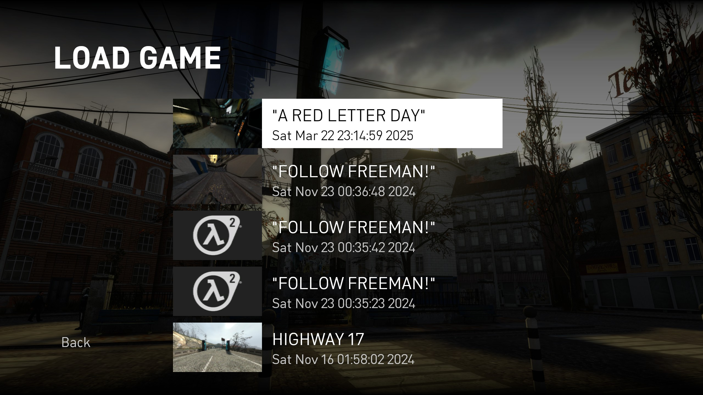
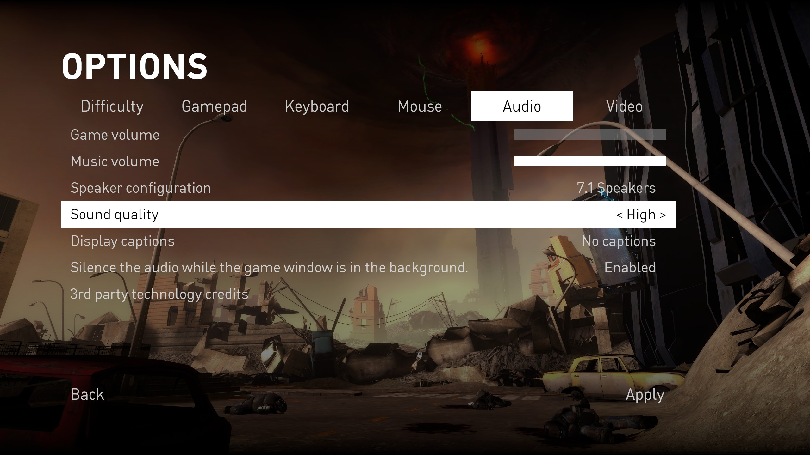

# Overwatch

Overwatch is a Garry's Mod framework for creating roleplaying servers. It is designed to be lightweight, modular, and easy to use.

### Installation

To install Overwatch, simply clone the repository into your `garrysmod/gamemodes` directory. You can do this by installing GitHub Desktop and cloning the repository.

### Usage

To use Overwatch, you must first create a new schema. A schema is a collection of entities, weapons, and other elements that define the rules of your new gamemode. You can create a new schema by creating a new folder in the same directory where the framework is installed.

### Contributing

If you would like to contribute to Overwatch, please fork the repository and submit a pull request. We are always looking for new contributors to help improve the framework.

### Credits

Overwatch was created by [Riggs](https://minerva-servers.com/porfolio/riggs9162) and [bloodycop](https://minerva-servers.com/porfolio/eon).

### TODO
- ### User Interface
    
    
    
    
    
- ### Inventory System
    - Weight Based Inventory System
    - Storage System
    - Item System
    - Item Pickup System
- ### Character System
    - Character Creation System
    - Character Selection System
    - Character Deletion System
    - Character Saving System
    - Character Loading System
- ### Player System
    - Player Data System

Test Commit Agfain